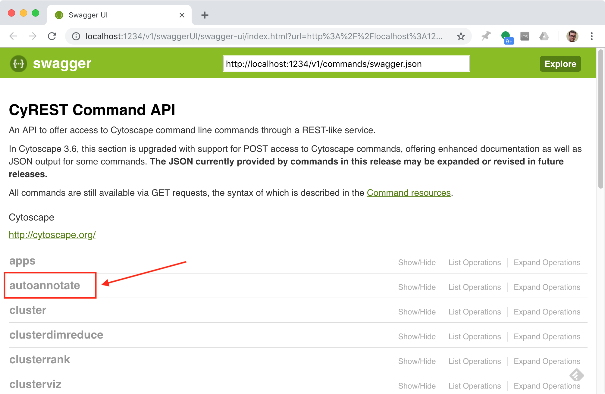
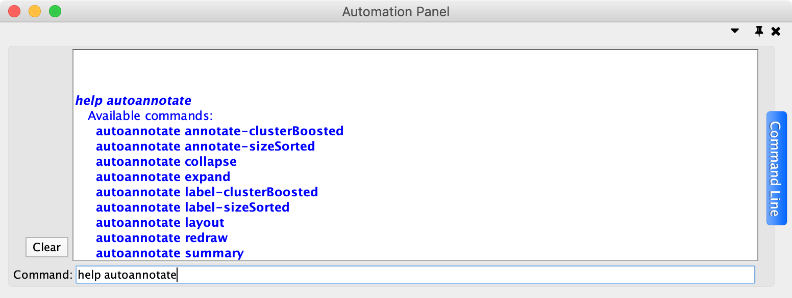

.. _automating:

Automating AutoAnnotate
=======================

AutoAnnotate provides several commands which allow basic features to be automated
via scripts, the command line or REST.

CyREST App
----------

To call commands via REST the CyREST App is required. CyREST is normally installed by default.

CyRest is updated often. There are two ways to install the latest version:

1. App Manager

   Open the **App Manager** dialog from the main menu at **Apps > App Manager**.
   Then go to the **Check For Updates** tab. If there is a newer version available it will be listed.

2. App Store

   CyRest can also be installed or updated from the 
   `App Store Website <http://apps.cytoscape.org/apps/cyrest>`_

Command Documentation
---------------------

CyREST Documentation
~~~~~~~~~~~~~~~~~~~~

On-line documentation for AutoAnnotate commands can be accessed from
the main menu at **Help > Automation > CyREST Command API**. This will open a web
browser with documentation for all the commands that are available through CyREST.
Navigate to the **autoannotate** entry and expand it for detailed documentation
on each command.

.. _Cytoscape Automation Manual Page: http://manual.cytoscape.org/en/stable/Programmatic_Access_to_Cytoscape_Features_Scripting.html

.. note:: For more details on Cytoscape Automation see the `Cytoscape Automation Manual Page`_.
          For more details on using CyRest see the 
          `CyREST Documentation <https://github.com/cytoscape/cyREST/wiki/Introduction>`_

Command Line Documentation
~~~~~~~~~~~~~~~~~~~~~~~~~~

Open the Automation Panel from the main menu at **View > Show Automation Panel**.

Type ``help autoannotate`` to list the available commands provided by AutoAnnotate.
To get help on a particular command type, for example the ``redraw`` command, 
type ``help autoannotate redraw``.

.. note:: For more details on the Automation Panel see the 
          `Cytoscape User Docs <http://manual.cytoscape.org/en/stable/Command_Tool.html>`_

