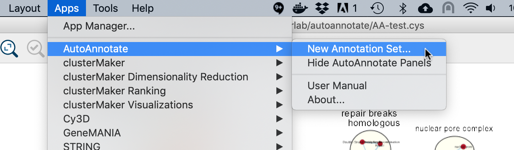
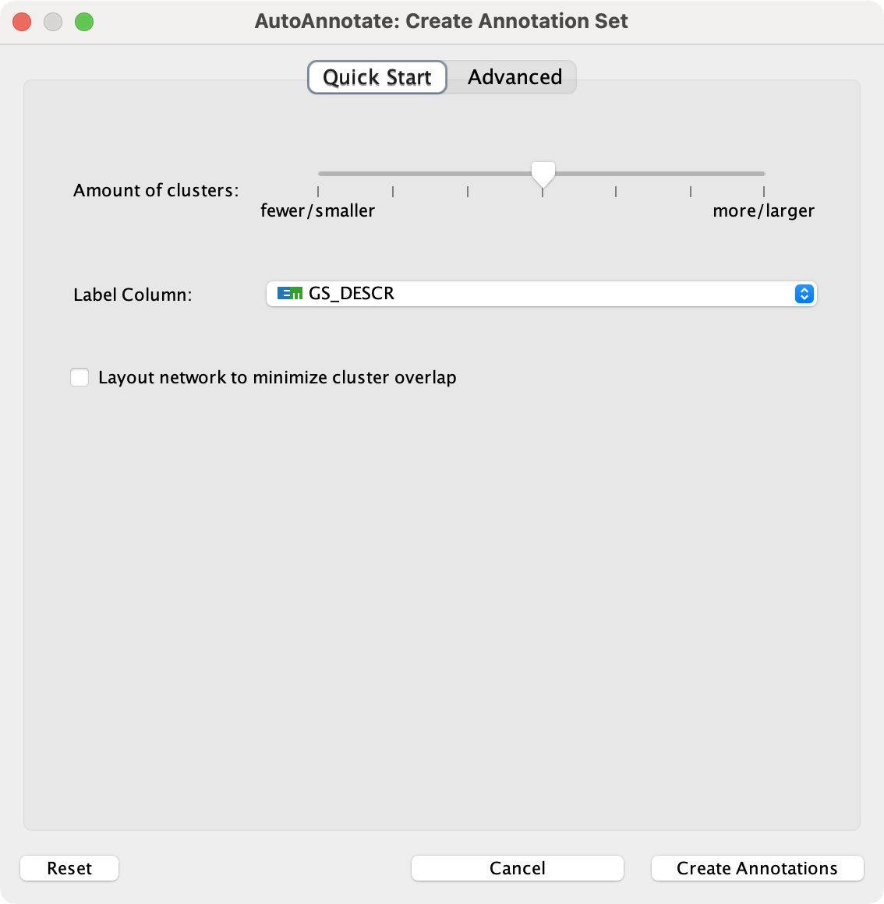
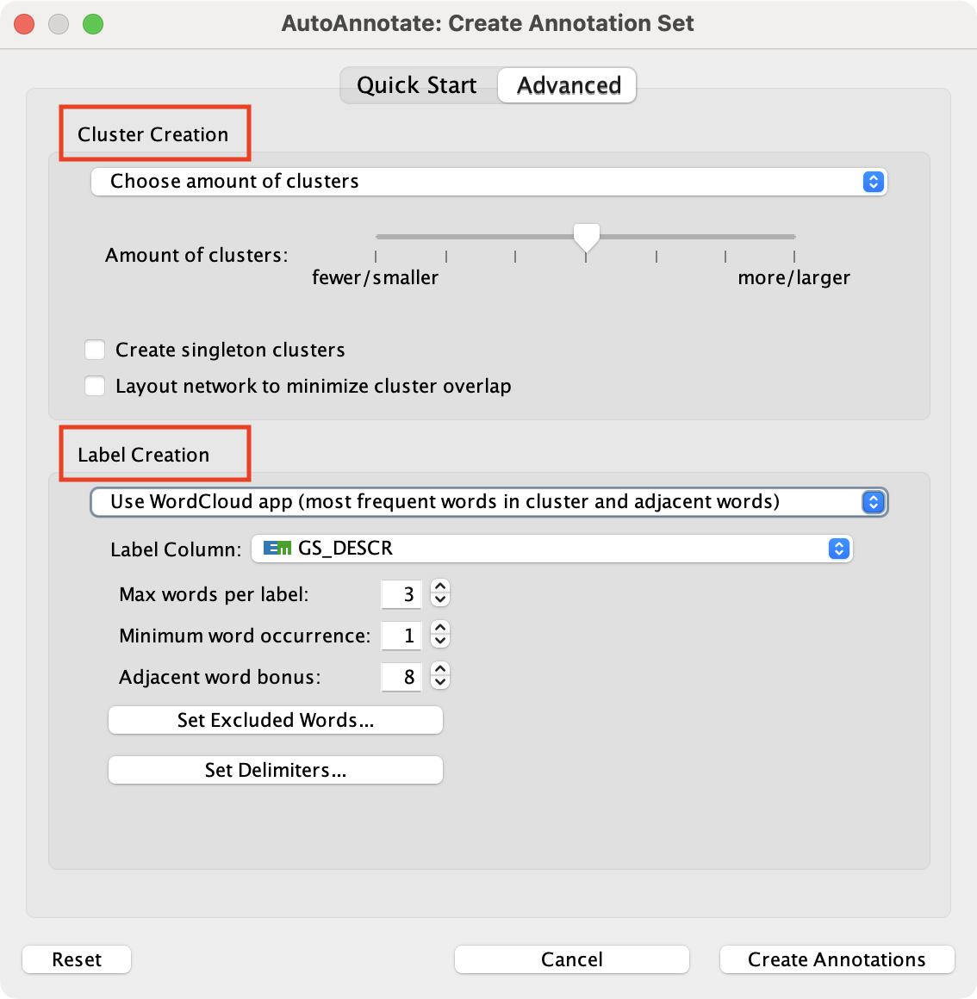

Creating an Annotation Set
==========================

* Start by selecting a network view.
* In the main menu select **Apps > AutoAnnotate > New Annotation Set...**
* The Create Annotation Set dialog will open.

Create Annotation Set Dialog
----------------------------

This dialog is used to select the options for creating an Annotation Set.

.. note:: AutoAnnotate can detect if the network was created by EnrichmentMap, 
          and if so sensible defaults for EnrichmentMap networks will be pre-selected.

.. note:: You may manually edit the contents and labels of the clusters after 
          the Annotation Set is created, and you may create as many Annotation Sets 
          as you like, so its not critical to get everything perfect at this step. 

The dialog has two tabs, **Quick Start** and **Advanced**.

Quick Start
-----------

The quick start tab has a minimal set of basic options.

 

Amount of clusters
  Determines if there should be a larger number of smaller clustes, or a smaller number of larger clusters.

Label Column
  Column used to generate the labels.

Layout network to mimimize cluster overlap
  Runs a layout algorithm that attempts to separate the clusters so that they do not overlap.

Advanced
--------

The Advanced tab provides full control over clustering and label options.
There are two sections

* Cluster Creation options
* Label Creation options

Cluster Creation Options
~~~~~~~~~~~~~~~~~~~~~~~~

  There are 4 different strategies that can be used to find clusters in the network.
  The strategy to use can be selected from the combo box.

  1. Choose amount of clusters

    Provides a simple slider that allows you to choose if there should be a larger number of 
    smaller clustes, or a smaller number of larger clusters.

    .. image:: images/create_dialog_advanced_clusters1.png
       :width: 500 px

  2. Use clusterMaker2 App

    This strategy allows finer control over how clusterMaker2 will find the clusters.
    You may choose from a list of clustering alogorithms provided by clusterMaker2.

    .. image:: images/create_dialog_advanced_clusters2.png
       :width: 500 px

    Cluster algorithm
      Used to select the clustering algorithm provided by clusterMaker that will 
      be used to calculate the clusters. See the table below for a list of clusterMaker algorithms 
      currently available for use in AutoAnnotate. 

    Edge weight column
      Some clusterMaker algorithms use edge weights. This box is used to select 
      the Edge Column to use for the edge weights. If the selected algorithm does 
      not use edge weights then this box will be disabled (greyed out). 

  3. Use MCODE App

    This strategy uses the MCODE app to find the clusters.

    .. image:: images/create_dialog_advanced_clusters3.png
       :width: 500 px

    The MCODE App is not installed by default. It can be downloaded here: https://apps.cytoscape.org/apps/mcode

  4. Use column with predefined cluster IDs

    You may provide your own clusters or use another clustering app to calculate 
    the clusters. 

    .. image:: images/create_dialog_advanced_clusters4.png
       :width: 500 px

    In this case the clusters must already be calculated and cluster 
    identifiers must be stored in a Node Column.
    Any Node Column of may be used to identify the clusters. 
    If you select a column of List type then the clusters may overlap.

  Additional Options

    Create Singleton Clusters
      Sometimes the cluster algorithm will leave some nodes un-clustered. If the 
      'create singleton clusters' option is selected then a cluster will be created 
      for each un-clustered node.

    Layout network to minimize cluster overlap
      Runs a layout algorithm that separates the clusters so that they do not overlap.

Label Creation Options
~~~~~~~~~~~~~~~~~~~~~~

There are 3 different strategies for generating labels for clusters.

  
  1. Name of most significant node in cluster

    .. image:: images/create_dialog_advanced_labels1.png
       :width: 500 px

    Finds the most "significant" node in each cluster and uses the chosen 
    column for the label.

    Label Column
      Select a Node Column that will be used for the cluster labels. 

    Significance
      This section provides options for how to decide which node in each cluster is the 
      most significant.

      Use node column for significance
        Compares values in the chosen column to decide which node is the most
        significant. There are options for choosing the node with the minimum, 
        maximum or largest absolute value.

      Use current EnrichmentMap chart settings for significance
        This option is available for networks created by the EnrichmentMap app.
        The Chart Data option in the Style section of the EnrichmentMap panel will
        determine how to decide which node is the most significant. 

  2. Use WordCloud app (most frequent words in cluster and adjacent words)

    .. image:: images/create_dialog_advanced_labels2.png
       :width: 500 px

    Uses the WordCloud app to calculate the labels.

    Words in the cluster labels are chosen from the most frequent words in the cluster,
    and words that are adjacent to the most frequent words.
    The higher the *"adjacent word bonus"* is, the more likely adjacent words will be included in 
    the label. 

  3. Use WordCloud app (most frequent words in cluster)

    .. image:: images/create_dialog_advanced_labels3.png
       :width: 500 px

    Uses the WordCloud app to calculate the labels.
    Words in the label are chosen from the most frequently occuring words in the cluster. 

  Set Excluded Words
    Opens a dialog that allows you to exclude words from cluster labels.
    See :ref:`label_options_words` for more details.

  Set Delimiters
    Opens a dialog that allows you to add word delimiters.
  

Click **Create Annotations** to create the new Annotation Set. 

.. warning:: AutoAnnotate will manage all groups (compound nodes) for the current network view. 
             It is not recommended to manually create groups on a network view that has Annotation Sets. 
             If you would like to manually create groups at any time please duplicate the network view.

ClusterMaker2 Algorithms
------------------------

The following clusterMaker2 algorithms are made available through AutoAnnotate:

============================= =========
Algorithm                     Weighted?
============================= =========
Affinity Propagation Cluster  Yes
Community cluster (GLay)      No
ConnectedComponents Cluster   Yes
MCL Cluster                   Yes
SCPS Cluster                  Yes
============================= =========

Weighted algorithms require an edge attribute to be used as the edge weight. 

