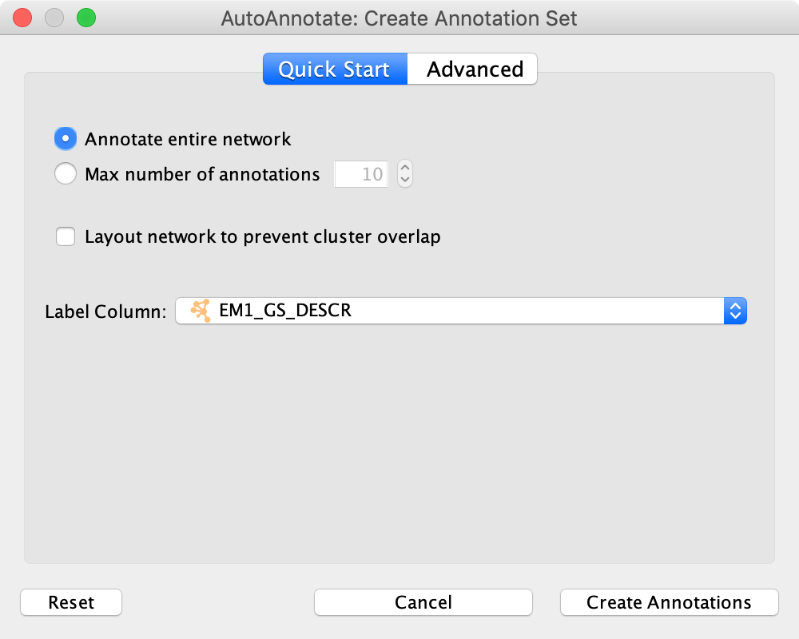

Creating an Annotation Set
==========================

* Start by selecting a network view.
* In the main menu select **Apps > AutoAnnotate > New Annotation Set...**
* The Create Annotation Set dialog will open.

Create Annotation Set Dialog
----------------------------

This dialog is used to select the options for creating an Annotation Set.

.. note:: AutoAnnotate can detect if the network was created by EnrichmentMap, 
          and if so sensible defaults for EnrichmentMap networks will be pre-selected.

.. note:: You may manually edit the contents and labels of the clusters after 
          the Annotation Set is created, and you may create as many Annotation Sets 
          as you like, so its not critical to get everything perfect at this step. 

The dialog has two tabs, **Quick Start** and **Advanced**.

Quick Start
~~~~~~~~~~~

The quick start tab has a minimal set of basic options.

 
Annotate the entire network
  Every node in the graph will be part of a cluster.

Maximum number of annotations
  If this is selected then only the X largest clusters in the network will be given annotations.

Layout network to prevent cluster overlap
  Runs a layout algorithm that separates the clusters so that they do not overlap.

Label Column
  Column used to generate the labels.

.. note:: Quick start uses clusterMaker2 MCL algorithm, with the "Adjacent Words" label option.

Advanced
~~~~~~~~

The Advanced tab provides full control over clustering and label options.

.. image:: images/create_dialog_advanced2.png
   :width: 450 px

Cluster Options

  Use clusterMaker App
    If this is selected then clusterMaker will be used to calculate the clusters.

  Cluster algorithm
    Used to select the clustering algorithm provided by clusterMaker that will 
    be used to calculate the clusters. See the table below for a list of clusterMaker algorithms 
    currently available for use in AutoAnnotate. 

  Edge weight column
    Some clusterMaker algorithms use edge weights. This box is used to select 
    the Edge Column to use for the edge weights. If the selected algorithm does 
    not use edge weights then this box will be disabled (greyed out). 

  User-defined clusters
    You may provide your own clusters or use another clustering app to calculate 
    the clusters. In this case the clusters must already be calculated and cluster 
    identifiers must be stored in a Node Column.
    Any Node Column of may be used to identify the clusters. 
    If you select a column of List type then the clusters may overlap. 

  Create Singleton Clusters
    Sometimes the cluster algorithm will leave some nodes un-clustered. If the 
    'create singleton clusters' option is selected then a cluster will be created 
    for each un-clustered node.

  Layout network to prevent cluster overlap
    Runs a layout algorithm that separates the clusters so that they do not overlap.

Label Options

  Label Column
    Select a Node Column that will be used to calculate the cluster labels. 

  Label Algorithm
    Select an algorithm that is used to calculuate the label for each cluster. Two label 
    algorithms are currently available:

        1. WordCloud: Adjacent Words

           Uses the WordCloud app to calculate the labels.

           Based on the algorithm that is used by the "Cloud Style: Clustered Standard" option 
           in WordCloud. Words in the label are chosen from the most frequent words in the cluster,
           and words that are adjacent to the most frequent words.
           The higher the *"adjacent word bonus"* is, the more likely adjacent words will be in 
           the label. 

        2. WordCloud: Largest Words

           Uses the WordCloud app to calculate the labels.

           Basically the same algorithm that is used by the "Cloud Style: No Clustering" option in WordCloud.
           Words in the label are chosen from the most frequent words in the cluster. 

Click **Create Annotations** to create the new Annotation Set. 

.. warning:: AutoAnnotate will manage all groups (compound nodes) for the current network view. 
             It is not recommended to manually create groups on a network view that has Annotation Sets. 
             If you would like to manually create groups at any time please duplicate the network view.

ClusterMaker2 Algorithms
------------------------

The following clusterMaker2 algorithms are made available in AutoAnnotate:

============================= =========
Algorithm                     Weighted?
============================= =========
Affinity Propagation Cluster  Yes
Cluster Fuzzifier             Yes
Community cluster (GLay)      No
ConnectedComponents Cluster   Yes
Fuzzy C-Means Cluster         Yes
MCL Cluster                   Yes
SCPS Cluster                  Yes
============================= =========

Weighted algorithms require an edge attribute to be used as the edge weight. 

