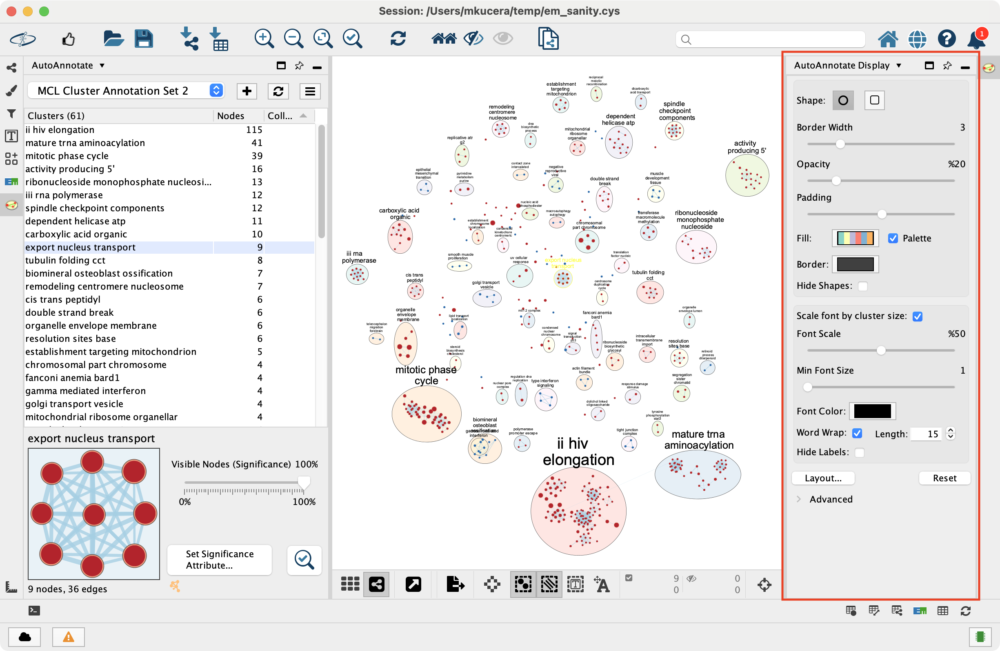
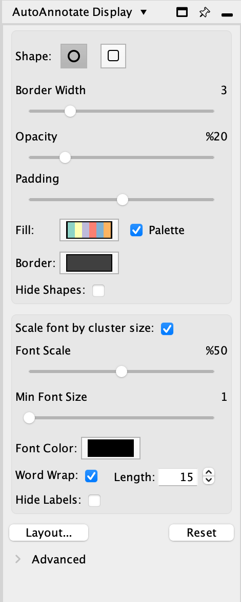
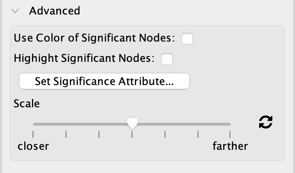

Display Options
===============

* In the **Results Panel** on the right side is the **Display Options Panel**.

  * This panel is used to modify the look of the annotations. 
  

Changing Display Options
------------------------

This AutoAnnotate Display panel shows display options for the currently selected Annotation Set.

Shape Options

  Shape
    There are two available shapes: Ellipse or Rectangle

  Border width
    Slider that adjusts the width of the cluster annotation borders.

  Opacity
    Slider that adjusts the opacity of the cluster annotation fill color.
    Slide to the left for completely transparent. Slide to the right for completely opaque. 

  Padding
    Slider that adjust the space between the content of a cluster and the annotation border.

  Palette
    When selected the annotations will have multiple colors from a color palette. 
    The color of each annotation is chosen automatically from the palette.

  Fill Color
    Opens a color picker for choosing the fill color.

  Border Color
    Opens a color picker for choosing the border color.

  Hide Shapes
    Select to hide all cluster shape annotations. 

Label Options

  Font Size
    Slider that adjusts the font size.

    Scale font by cluster size
      When selected the size of the label will be relative to the number of 
      nodes in the cluster. Larger clusters will have larger labels.
      When deselected all the clusters will have the same size labels. 
      Slider is used to adjust the font size or font scale.

  Font Color
    Opens a color picker for choosing the font color.

  Word Wrap
    Allows long labels to be broken and wrap onto the next line.

    Wrap Length
      Defines the maximum width of the label in number of characters.
      Individual words that are longer than the wrap length will not be broken.
      Has no effect if Word Wrap is disabled.

  Hide Labels
    Select to hide all cluster labels. 

Reset Button

  Sets all the display options back to their defaults.

Advanced Options
----------------

Use color of significant nodes
  If this option is enabled then the color of each cluster annotation will be the
  same as the color of the most significant node in the cluster.

Highlight significant nodes
  If this option is enabled then the most significant node in each cluster will
  be highlighted by making its label larger.

Set significance attribute
  Opens a small dialog that lets you choose which column (or EnrichmentMap chart)
  to use to compare the nodes in each cluster to determine which node is the most
  significant.

Scale
  This slider is used to increase or decrease the spacing between the nodes in the network.
  The slider behaves the same as the one in the Layout Tools panel.

