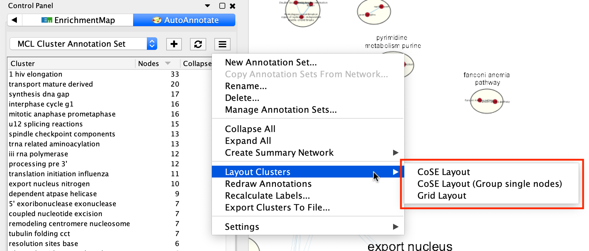
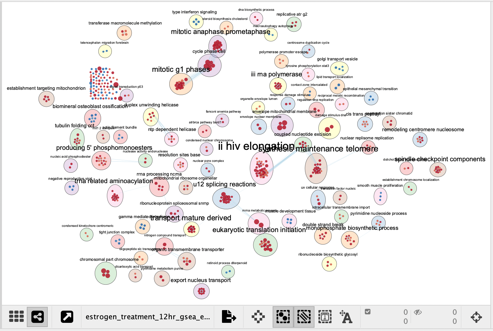
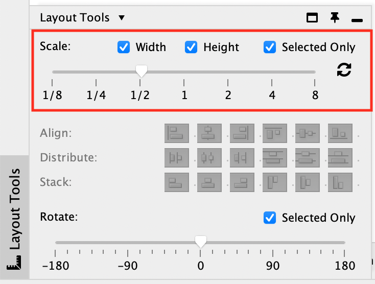
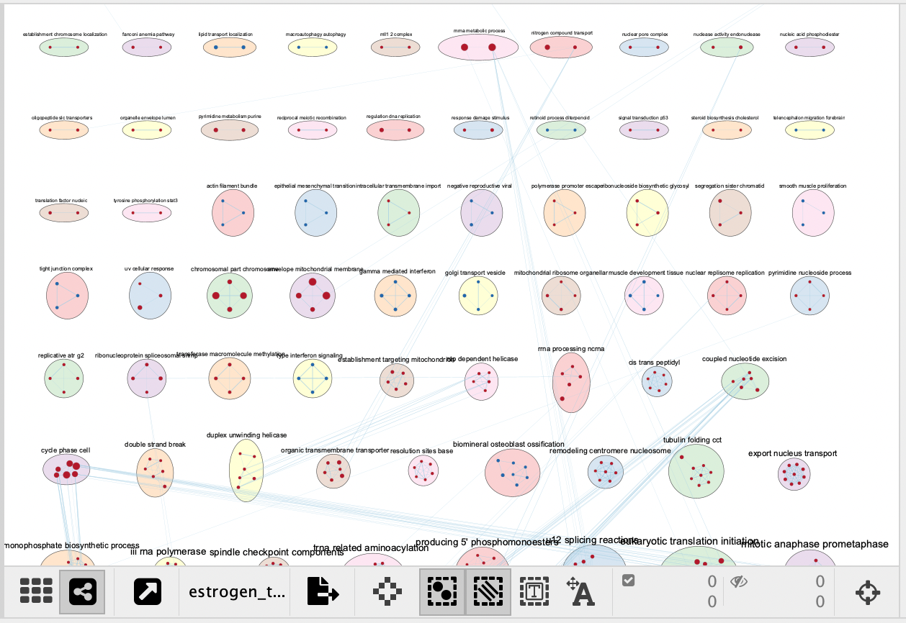
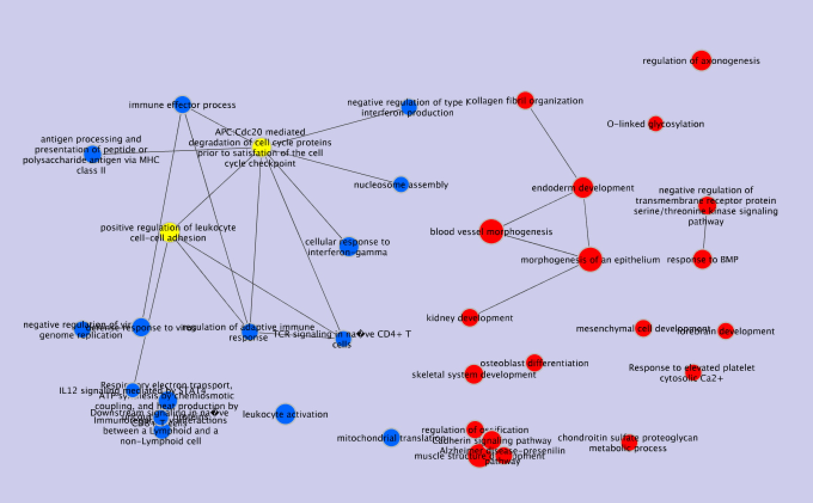
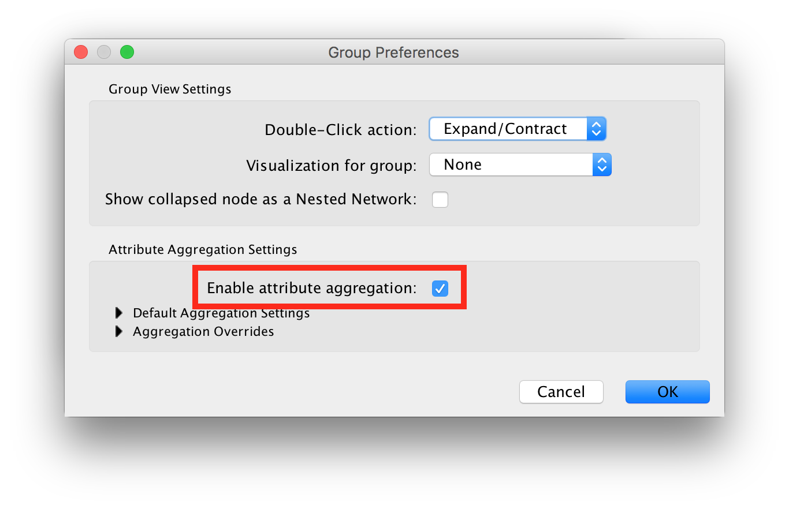

Grouping and Layout
===================

.. _cluster_aware_layouts:

Cluster-Aware Layouts
---------------------

AutoAnnotate provides three cluster-aware layout algorithms. These are available from the
panel menu.

CoSE Layout
~~~~~~~~~~~

The CoSE (Compound Spring Embedded) layout is a force-directed layout that is cluster-aware.
It will attempt to minimize cluster overlap while still placing connected clusters
near each other.

Cluster annotations will still sometimes overlap. If this is happening try running
the layout again or manually adjust the position of the clusters.

There are two versions of CoSE available. The standard version will allow unclustered nodes
to be placed about the graph. The **CoSE Layout (Group Single Nodes)** version will group 
all unclustered nodes together rather than allowing them to be spread about the graph.

If you would like to increase or decrease the spacing between clusters this can be done from the
**Layout Tools** panel after running the layout. The **Layout Tools** panel is available near the
bottom-left of the Cytoscape window. Use the **Scale** slider to increase or decrease the cluster 
spacing.

Grid Layout
~~~~~~~~~~~

The clusters are laid out in a grid pattern. The nodes within each cluster are laid out
using a standard force-directed layout.

This layout is slower and less esthetically pleasing that the CoSE layout. This was 
the only layout available in older versions of AutoAnnotate and is still available
mainly for backwards compatibility.

Collapsing and Expanding Clusters
---------------------------------

AutoAnnotate can summarize a network by collapsing some or all of the clusters automatically.

.. warning:: Depending on the number of clusters this function can be very slow. Consider using 
             the **Create Summary Network** option instead because it runs significantly faster. 
             See :ref:`summary_network` for more details.

The Cytoscape "group nodes" feature is used to collapse and expand clusters. A group node is a 
compound node that contains other nodes. 

When AutoAnnotate collapses a cluster it first creates a group node that contains all the nodes 
in the cluster and then the group node is collapsed. When the cluster is collapsed Cytoscape 
will create "meta-edges" between the group node any other nodes it is connected to. The collapsed 
group nodes and the meta-edges provide a summary of the network.

When a cluster is expanded the group node is expanded and then deleted. The annotations are shown 
again.

.. note:: The annotation for a cluster is not shown when the cluster is collapsed. The label shown for a 
   collapsed cluster is generated by Cytoscape and depends on the Group Preferences (explained below).

.. warning:: It is not recommend to manually collapse or expand clusters using the Groups menu as this may 
   confuse AutoAnnotate. When switching between Annotation Sets all collapsed clusters are 
   automatically expanded.

.. warning:: There are currently some limitations in Cytoscape with regards to saving and restoring 
   annotations and groups in a session file. For this reason when you save your session all the clusters 
   must be expanded first.

Clusters can be collapsed or expanded from the Annotation Set Menu or the Cluster Table Context 
Menu. Before collapsing clusters make sure that node aggregation is enabled. This will tell 
Cytoscape to generate a label for the group node that aggregates the labels of the nodes in the 
cluster.

* In the main menu select **Edit > Preferences > Group Preferences**.
* In the Group Preferences dialog select the option for Enable Attribute Aggregation. 

Create Summary Network
----------------------

Using group nodes to collapse clusters can be very slow when there are many clusters. As an alternative 
a new option called **Create Summary Network** has been added in AutoAnnotate 1.1. A new network is 
generated where each node represents a collapsed cluster in the original network, and each edge represents 
a meta-edge between clusters. The resulting network is very similar to the results you get from collapsing 
the clusters.

See :ref:`summary_network` for more details.