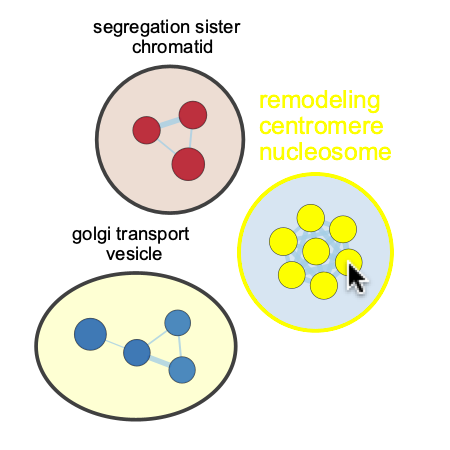

Moving and Resizing Clusters
============================

Resizing Clusters
-----------------

Selecting one or more nodes in a cluster and then dragging them will cause
the cluster annotation to resize.
To select a single node, simply click on it. To add more nodes to the selection
hold *Ctrl* (or *Cmd* on mac) and then click on the additional nodes.

================= ================= =================
Before            Select            Drag
================= ================= =================
|resize_before|   |resize_select|   |resize_after|
================= ================= =================

Moving Clusters
---------------

Selecting all of the nodes in a cluster and then dragging will cause
the cluster annotation to move along with the nodes.

================= ================= =================
Before            Select            Drag
================= ================= =================
|move_before|     |move_select|     |move_after|
================= ================= =================

Selecting Clusters
------------------

There are a few ways to select all the nodes in a cluster.

* Click on the name of a cluster in the AutoAnnotate panel.

* Right-click on any node in the cluster. In the menu select *Apps > AutoAnnotate - Select Cluster*.

.. image:: images/select_cluster.png
   :width: 500px

* Hold *Shift* and draw a selection rectangle around the cluster.
  In Cytoscape version 3.10 or later you can hold *Ctrl-Shift* (or *Cmd-Shift* on mac)
  and draw a selection lasso around the cluster.

============================ =============================
Selection Rectangle (Shift)  Selection Lasso (Ctrl-Shift)
============================ =============================
|select_rectangle|           |select_lasso|
============================ =============================

Adjusting Padding
-----------------

The size of a cluster annotation can be adjusted using the **Padding**
slider in the **AutoAnnotate Display** panel.

================= =================
Before            After
================= =================
|padding_before|  |padding_after|
================= =================