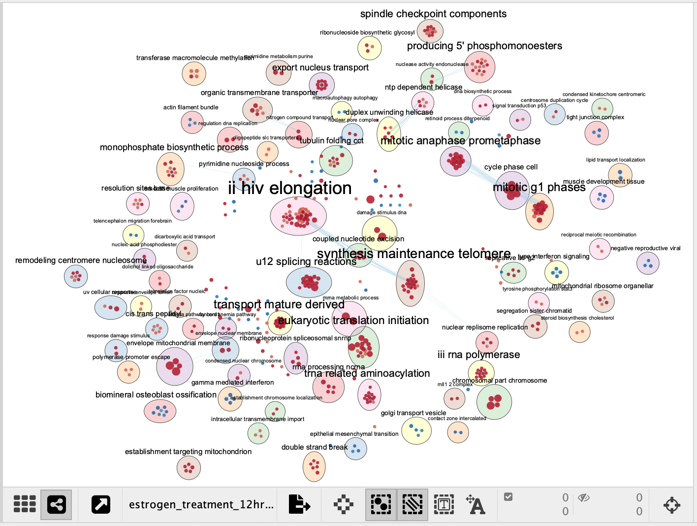
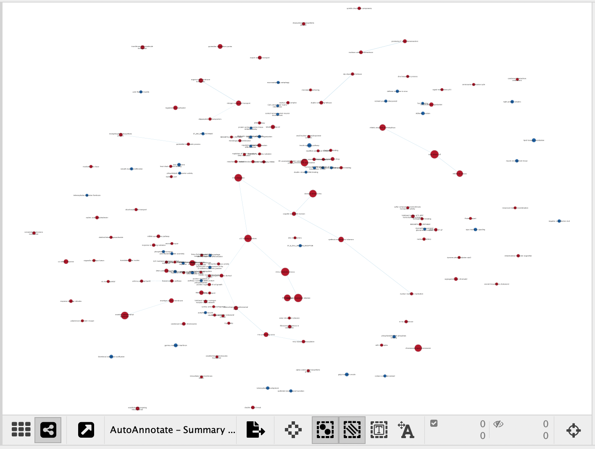
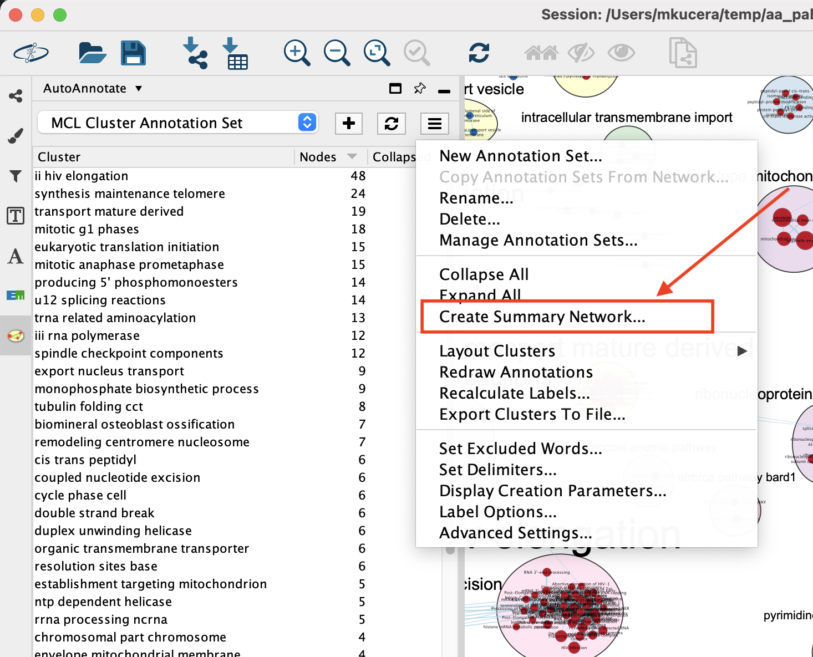
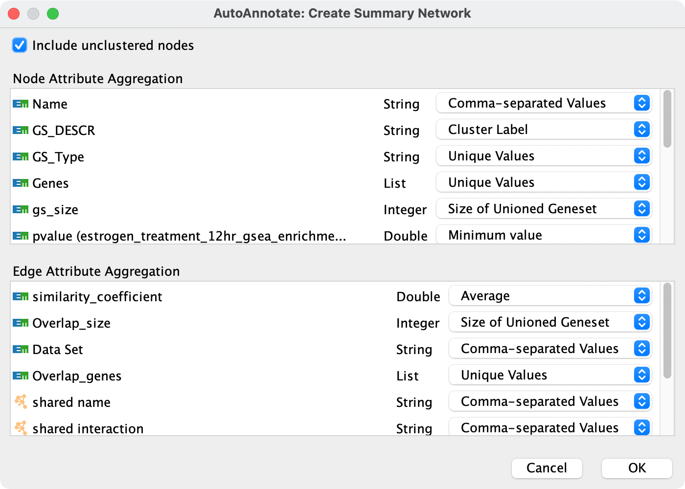

.. _summary_network:

Summary Network
===============

A Summary Network is a new network where each node represents a collapsed cluster in the original network, 
and each edge represents a meta-edge between clusters. The resulting network is very similar to the results 
you get from collapsing the clusters.

============ ============
Before       After
============ ============
|before|     |after|
============ ============

A summary network can be created from the Annotation Set Menu or the Cluster Table Context Menu.

.. note:: The terms "attribtue" and "column" are used interchangeably.

Attribute Aggregation
---------------------

Each cluster in the source network will be compressed into a single node in the Summary network.
If there are multiple edges between two clusters, they will be compressed into a single meta-edge.

The nodes in a cluster may have different values for each data attribute (i.e. column).
When the nodes in a cluster are compressed into a single node, the values of the attriutes
of the original nodes need to be combined into a single value. There are many options for how
this can be done. The same is also true for the edges that are compressed into a meta-edge.

When creating a summary network a dialog is shown
that allows you to choose the aggregation strategy for each attribute.
Sensible defaults are chosen, so you may safely click **OK**. However if you would like to
customize how attribtues are aggregated use the combo boxes next to each attribute name.

Types of Aggregators
--------------------

**None**

  The resulting value will always be blank.

**Comma Separated Values, Tab Separated Values**

  The values will be concatenated together using commas or tabs as delimiters.

**Most Common Value**

  The most common value will be chosen. Ties are broken arbitrarily.

**Unique Values**

  Takes all the values for an attribute, removes the duplicates, then concatenates the results (using commas as delimiters).
  For example, a set of nodes with values ``"a", "a", "a", "b", "b", "c"`` would become a string with the value ``"a,b,c"``.

**Cluster Label**

  Ignores the values of the attribute and uses the cluster label value.
  Note: If you want a new attribute (column) that contains the cluster label then you must create a 
  new column in the source network before creating the summary network.

**Most Significant Gene Set (EnrichmentMap only)**

  The resulting value is the name of the gene set that has the most significant FDR q-value.
  If there are ties then the result is the concatenation of the gene set names.

**Average, Minimum, Maximum, Median, Sum (Numeric Attributes)**

  Combines numeric values using the corresponding mathematical operator.

**Size of Unioned Geneset (EnrichmentMap only)**

  Nodes in EnrichmentMap networks represent gene sets. 
  The resulting value is the size of the union of all the gene sets in the cluster.

**Greatest Magnitude (EnrichmentMap only)**

  The result is the value that has the greatest absolute value (i.e. magnitude).
  For example the set ``-1, 0, 1, 2`` would result in ``2``, and the set ``-2, -1, 0, 1`` would result in ``-2``.

**Logical AND, Logical OR**

  Used to combine boolean values.

**Concatenate (Lists only)**

  Concatenates the values of list columns. For example ``[1,2,3]`` and ``[4,5,6]`` would result in ``[1,2,3,4,5,6]``.

