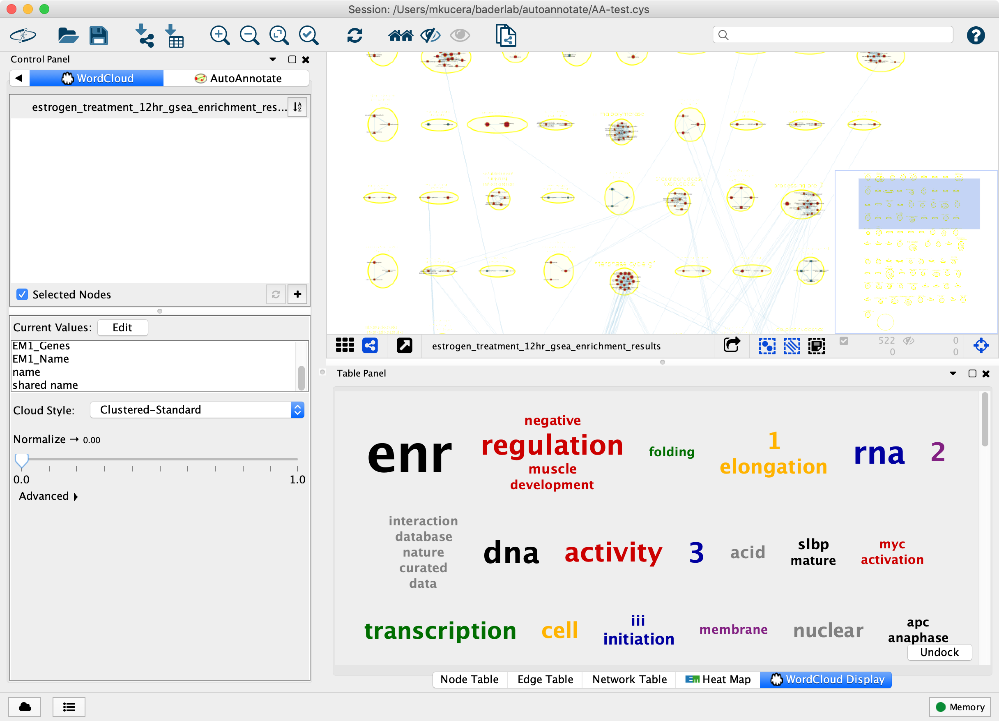
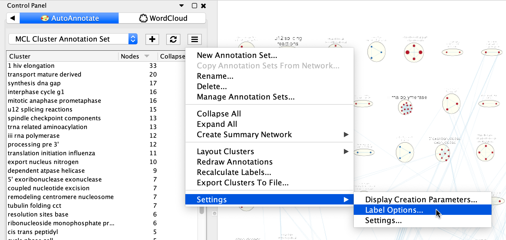
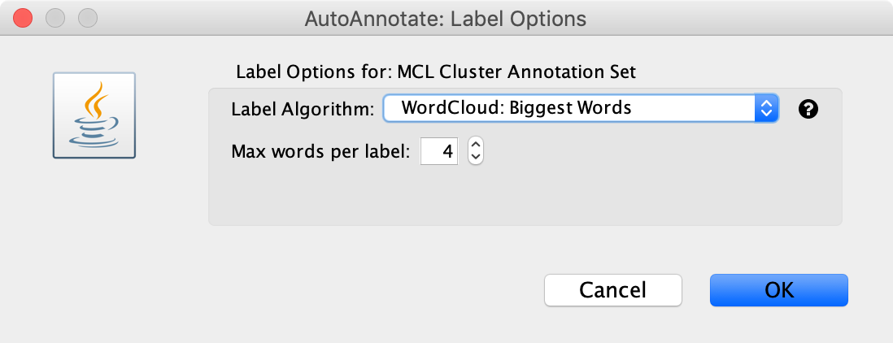
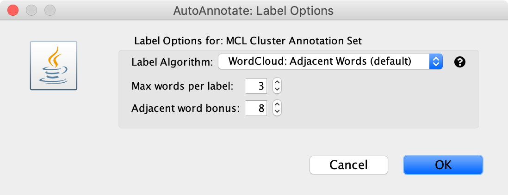
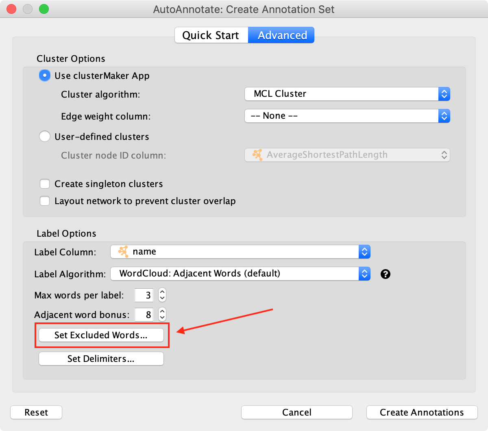
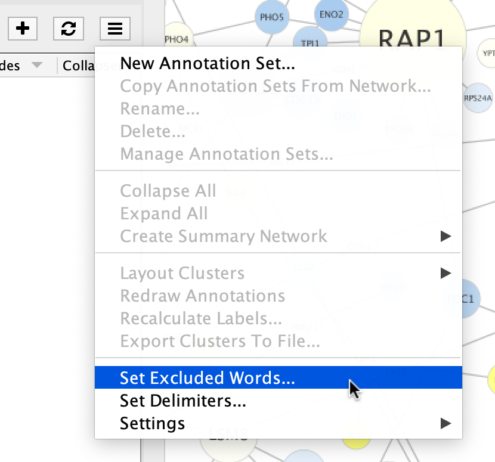
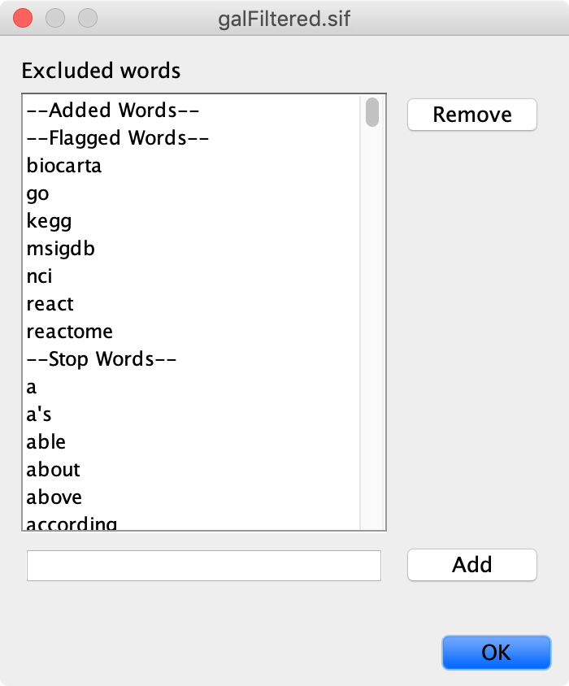

.. _label_options:

Label Options
=============

AutoAnnotate uses the WordCould app to generate cluster labels. Some basic label
options are available from the AutoAnnotate panel menu, but more advanced options
are available through WordCloud directly.

WordCloud App
-------------

The WordCloud app generates a "word cloud" for selected nodes based on one or more attributes (columns)
of choice.

AutoAnnotate invokes WordCloud to generate a word tag cloud for the node data within each cluster, 
which is used to derive the text for the label annotations.

Basic Label Options
-------------------

Basic label options are available from the AutoAnnotate panel menu at **Settings > Label Options...**.

This will open the **Label Options** dialog. (These are the same options available in the **Create
Annotation Set Dialog**.)

There are two label algorithms available...

Biggest Words
~~~~~~~~~~~~~

The “Biggest Words” option generates a word cloud for the nodes in each cluster.
The words are sorted by size then the N largest words are chosen.

The only option available is to choose the maximum number of words in each label.

Adjacent Words
~~~~~~~~~~~~~~

The “Adjacent Words” option is a heuristic that attempts to balance word size with 
word adjacency. Words that are adjacent to the largest words are given a size bonus
making them more likely to be chosen for the label. 

A word cloud is generated for the nodes in each cluster.
The words are sorted by size, then a size bonus is added 
to every word that is adjacennt to the N largest words. This causes 
words that are adjacent to the N largest words to be more likely to be chosen. 
Then the list is sorted again by size and the N largest words (with bonus) are selected.

The **adjacent word bonus** option is used to decide how much of a size bonus to 
give to words that are adjacent to the largest workds. The default value is 8.

.. _label_options_words:

Removing Words from Labels
--------------------------

If you do not want certain words to appear in cluster labels they may be removed.

To remove words before creating an Annotation Set click the **Set Excluded Words** button
in the Create Annotation Set Dialog.

If you have already created an Annotation Set you can exclude words and generate new labels. 
Select **Set Excluded Words** from the Annotation Set menu. After adding words you must
go back to the menu and select **Recalculate Labels**. The labels will
be regenerated and the excluded words will no longer be chosen.

Either of these actions will open the Excluded Words Dialog.

.. warning:: If the **Set Excluded Words** button or menu option is not available then please 
             upgrade the WordCloud plugin. WordCloud version 3.1.3 or higher is required to 
             enable this functionality.

Advanced WordCloud Options
--------------------------

Several options in WordCloud effect how cluster labels are generated.

In the main menu select **Apps > WordCloud > Show WordCloud**.

In the WordCloud panel you can change options that effect the contents of each cluster's word cloud,
for example using the Normalize slider.

Back in the AutoAnnotate panel select **Recalculate Labels** to regenerate labels using the updated 
WordCloud options. 

