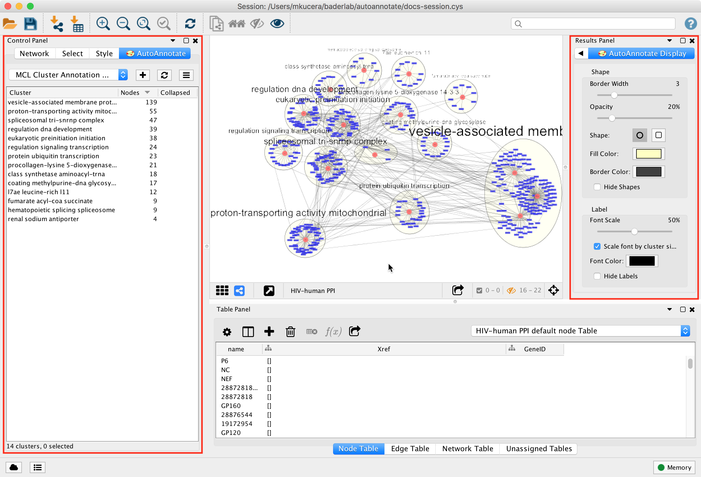
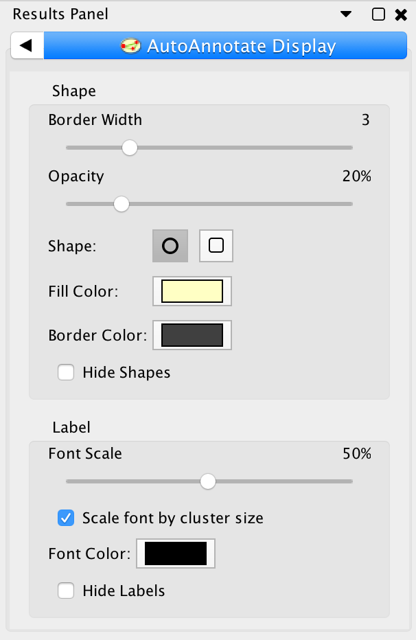
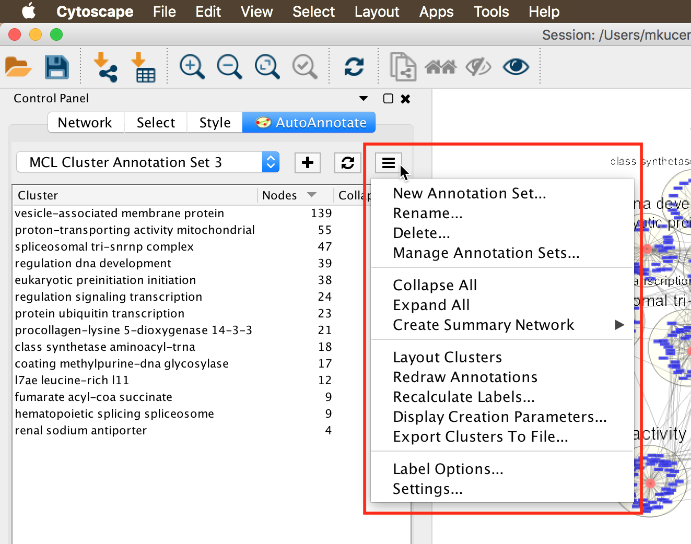

Working With AutoAnnotate
=========================

Panels
------

When an Annotation Set is created the AutoAnnotate panels will be shown.

.. note:: To show or hide the AutoAnnotate panels go to the main menu and 
          select **Apps > AutoAnnotate > (Show/Hide) AutoAnnotate**. 

* In the **Control Panel** on the left side is the **Main AutoAnnotate Panel**.

  * This panel is used to manage Annotation Sets and Clusters. 

* In the **Results Panel** on the right side is the **Display Options Panel**.

  * This panel is used to modify the look of the annotations. 

Changing Display Options
------------------------

This AutoAnnotate Display panel shows display options for the currently selected Annotation Set.

Shape Options

  Border width
    Slider that adjusts the width of the cluster annotation borders.

  Opacity
    Slider that adjusts the opacity of the cluster annotation fill color.
    Slide to the left for completely transparent. Slide to the right for completely opaque. 

  Shape
    There are two available shapes: Ellipse or Rectangle

  Hide Shapes
    Select to hide all cluster shape annotations. 

  Fill Color
    Opens a color picker for choosing the fill color.

  Border Color
    Opens a color picker for choosing the border color.

Label Options

  Font Size
    Slider that adjusts the font size.

    Scale font by cluster size
      When selected the size of the label will be relative to the number of 
      nodes in the cluster. Larger clusters will have larger labels.
      When deselected all the clusters will have the same size labels. 
      Slider is used to adjust the font size or font scale.

  Font Color
    Opens a color picker for choosing the font color.

  Hide Labels
    Select to hide all cluster labels. 

Managing Annotation Sets
------------------------

The main AutoAnnotate panel is used to manage Annotation Sets.

.. image:: images/annotation_set_combo.png
   :width: 350px

At the top of the panel is a dropdown box that allows you to switch between all of 
the Annotation Sets that have been created for the current network view.

* Select the (none) option to clear all annotations from the view.
* Select an Annotation Set to show all the annotations and labels in that set.
* When switching between Annotation Sets all the annotations in the view will be erased and redrawn.

  * Similarly when switching Annotation Sets any collapsed groups will be expanded. 

.. |button_plus|   image:: images/button_plus.png
   :width: 25px

.. |button_menu|   image:: images/button_menu.png
   :width: 25px

.. |button_redraw| image:: images/button_redraw.png
   :width: 25px

Click the |button_menu| button to show the Annotation Set Menu.

  New Annotation Set…
    Opens the Create Annotation Set dialog. 
    The dialog can also be opened by clicking the |button_plus| button.

  Rename
    Renames the current annotation set.

  Delete...
    Deletes the current annotation set.

  Manage Annotation Sets...
    Opens a Dialog where you can change the order that Annotation Sets appear 
    in the dropdown and delete multiple Annotation Sets at a time. 

  Collapse All
    Collapses all the clusters. **Warning**: Collapsing all clusters in a large network 
    can be very slow. Consider using the **Create Summary Network** option instead. 

  Expand all
    Expands all the clusters.

  Create Summary Network
    Generates a new network where each node represents a collapsed cluster in the original network.
    Very similar in functionality to "Collapse All", but runs significantly faster. 

  Layout Clusters
    Runs a layout algorithm that will layout each cluster separately using the perfuse
    layout (evenly spaced in a grid). Note: this operation cannot be undone. 

  Redraw annotations
    Older versions of Cytoscape have a bug that cause annotations to occasionally be
    drawn in the wrong location. Redrawing the annotations can fix this problem.
    Annotations can also be redrawn by clicking the |button_redraw| button.

  Recalculate Labels
    Recalculates the labels for all of the clusters in the annotation set. 
    Typically used when the WordCloud options or label algorithm changes. 
    More on this later in this guide. (Note: to recalculate labels for a 
    subset of clusters please select the clusters in the table and right-click 
    to show the cluster context menu.) 
  
  Display Creation Parameters...
    Opens a dialog that shows the parameters that were chosen in the Create Annotation Set Dialog
    for the current Annotation Set.

  Export Clusters to File...
    Creates a TXT file containing the labels of all the clusters.

  Label Options
    Opens a dialog where you can select the label algorithm that is used when recalculating labels. 

  Settings...
    Opens the AutoAnnotate settings dialog. 

Managing Clusters
-----------------

On the main AutoAnnotate panel you will find the Cluster Table.

* This table shows each cluster, along with its label, the number of nodes in the 
  cluster and a checkbox icon that indicates if the cluster has been collapsed.
* Click on a table header to sort the table by that column. 

Most of the cluster options are available using the context menu of the cluster table.

* Start by selecting one or more clusters in the cluster table.
* To select multiple clusters hold the Shift key to select a range or hold 
  the Ctrl/Command key to select individual clusters. 

.. image:: images/menu_clusters.png
   :width: 400 px

Right click with he mouse to show the cluster table context menu.

  Rename…
    Enabled when 1 cluster is selected.
    Manually set the label for the cluster. 

  Delete
    Delete the cluster annotations.
    Note: This does not delete the nodes or edges in the cluster, just the annotations. 

  Merge
    Enabled when 2 or more clusters are selected.
    Merges the clusters into a single cluster.
    A new label for the merged cluster is automatically calculated. 

  Extract Clusters…
    Creates a new Annotation Set consisting of the selected clusters. 

  Collapse
    Collapses the selected clusters.
    Warning: can be very slow when many clusters are selected. 

  Expand
    Expands the selected clusters.

  Generate Summary Network
    Generates a new network where each node represents a collapsed cluster that is 
    selected in the original network.
    Very similar in functionality to "Collapse", but runs significantly faster. 

  Recalculate Labels
    Recalculates the labels for the selected clusters. 

Managing Clusters in the Network View
-------------------------------------

To manually create a cluster select some nodes in the network view, right click to 
show the context menu, and select **Apps > AutoAnnotate > Create Cluster**.

.. image:: images/menu_network.png
   :width: 400 px

* A new cluster is created.
* A label for the cluster is automatically calculated.
* The cluster is selected in the cluster table. 

Deleting a node in an existing cluster will remove the node from the cluster. A new label 
is calculated. 

Collapsing and Expanding Clusters
---------------------------------

AutoAnnotate can summarize a network by collapsing some or all of the clusters automatically.

.. warning:: Depending on the number of clusters this function can be very slow. Consider using 
             the **Generate Summary Network** option instead because it runs significantly faster. 
             See the section below for more details.

.. image:: images/collapsed_network.png
   :width: 500 px

The Cytoscape "group nodes" feature is used to collapse and expand clusters. A group node is a 
compound node that contains other nodes. 

When AutoAnnotate collapses a cluster it first creates a group node that contains all the nodes 
in the cluster and then the group node is collapsed. When the cluster is collapsed Cytoscape 
will create "meta-edges" between the group node any other nodes it is connected to. The collapsed 
group nodes and the meta-edges provide a summary of the network.

When a cluster is expanded the group node is expanded and then deleted. The annotations are shown 
again.

.. note:: The annotation for a cluster is not shown when the cluster is collapsed. The label shown for a 
   collapsed cluster is generated by Cytoscape and depends on the Group Preferences (explained below).

.. warning:: It is not recommend to manually collapse or expand clusters using the Groups menu as this may 
   confuse AutoAnnotate. When switching between Annotation Sets all collapsed clusters are 
   automatically expanded.

.. warning:: There are currently some limitations in Cytoscape with regards to saving and restoring 
   annotations and groups in a session file. For this reason when you save your session all the clusters 
   must be expanded first.

Clusters can be collapsed or expanded from the Annotation Set Menu or the Cluster Table Context 
Menu. Before collapsing clusters make sure that node aggregation is enabled. This will tell 
Cytoscape to generate a label for the group node that aggregates the labels of the nodes in the 
cluster.

* In the main menu select **Edit > Preferences > Group Preferences**.
* In the Group Preferences dialog select the option for Enable Attribute Aggregation. 

.. image:: images/group_preferences.png
   :width: 400 px

Summary Network
---------------

Using group nodes to collapse clusters can be very slow when there are many clusters. As an alternative 
a new option called **Generate Summary Network** has been added in AutoAnnotate 1.1. A new network is 
generated where each node represents a collapsed cluster in the original network, and each edge represents 
a meta-edge between clusters. The resulting network is very similar to the results you get from collapsing 
the clusters.

The main differences are:

  * Nodes that are not contained in any cluster are ignored.
  * There is no relationship maintained back to the original network. If the clusters in the 
    original network change the summary network will not be updated. Create a new summary 
    network at any time to reflect the current state of the clusters.
  * A new visual style for the summary network is created based on the original visual style.

A summary network can be created from the Annotation Set Menu or the Cluster Table Context Menu.

Summary network uses the same attribute aggregation settings as collapsed group nodes. 
Available from **Edit > Preferences > Group Preferences** then expand the Default Aggregation Settings 
section. 

Working with WordCloud
----------------------

Labels for clusters are generated by the WordCloud app.

  * You may change the label generation options from the WordCloud panel.
  * In the main menu select **Apps > WordCloud > Show WordCloud**.
  * In the WordCloud panel you can change the label options, for example using the Normalize slider.
  * Back in the AutoAnnotate panel select **Recalculate Labels** to regenerate labels using the updated 
    WordCloud options. 

Additional Options
------------------

AutoAnnotate has various warning dialogs that can be dismissed permanently by selecting "don’t show this 
again". If you would like to see these warnings again they can be re-enabled. In the main menu 
select **Edit > Preferences > Properties**, then select **org.baderlab.autoannotate** in the Properties 
Dialog.  

.. image:: images/cytoscape_preferences.png
   :width: 400 px

