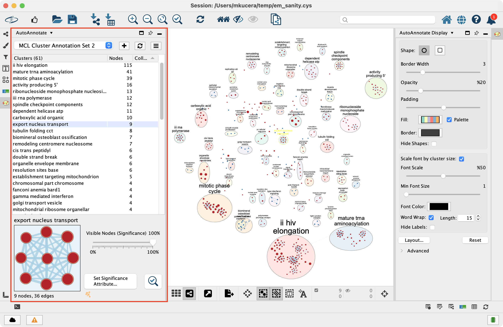
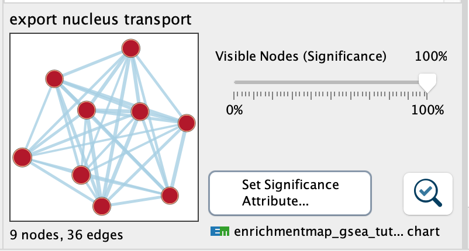
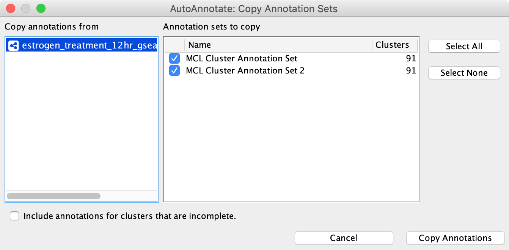

Working With AutoAnnotate
=========================

Panels
------

When an Annotation Set is created the AutoAnnotate panels will be shown.

To show or hide the AutoAnnotate panels go to the main menu and 
select **Apps > AutoAnnotate > (Show/Hide) AutoAnnotate Panels**. 

* In the **Control Panel** on the left side is the **Main AutoAnnotate Panel**.

  * This panel is used to manage Annotation Sets and Clusters. 

Managing Annotation Sets
------------------------

The main AutoAnnotate panel is used to manage Annotation Sets.

At the top of the panel is a dropdown box that allows you to switch between all of 
the Annotation Sets that have been created for the current network view.

* Select the (none) option to clear all annotations from the view.
* Select an Annotation Set to show all the annotations and labels in that set.
* When switching between Annotation Sets all the annotations in the view will be erased and redrawn.

  * Similarly when switching Annotation Sets any collapsed groups will be expanded. 

Annotation Set Menu
-------------------

.. image:: images/menu3.png
   :width: 400px

Click the |button_menu| button to show the Annotation Set Menu.

  New Annotation Set...
    Opens the Create Annotation Set dialog. 
    The dialog can also be opened by clicking the |button_plus| button.

  Copy Annotation Sets from Network...
    Allows annotations to be copied from one network to another. See `Copying Annotations Between Networks`_ 
    for more details.

  Rename
    Renames the current annotation set.

  Delete...
    Deletes the current annotation set.

  Manage Annotation Sets...
    Opens a Dialog where you can change the order that Annotation Sets appear 
    in the dropdown and delete multiple Annotation Sets at a time. 

  Collapse All
    Collapses all the clusters. **Warning**: Collapsing all clusters in a large network 
    can be very slow. Consider using the **Create Summary Network** option instead. 

  Expand all
    Expands all the clusters.

  Create Summary Network
    Generates a new network where each node represents a collapsed cluster in the original network.
    Very similar in functionality to "Collapse All", but runs significantly faster. 
    See :ref:`summary_network` for more details.

  Layout Clusters
    The submenu provides access to cluster-aware layout algorithms. See :ref:`cluster_aware_layouts`
    for more details.

  Redraw annotations
    Some versions of Cytoscape have a bug that cause annotations to occasionally be
    drawn in the wrong location. Redrawing the annotations can fix this problem.
    Annotations can also be redrawn by clicking the |button_redraw| button.

  Recalculate Labels
    Recalculates the labels for all of the clusters in the annotation set. 
    Typically used when the WordCloud options or label algorithm changes, or if the contets of 
    one or more clusters change. See :ref:`label_options` for more details. 
    (Note: to recalculate labels for a 
    subset of clusters please select the clusters in the table and right-click 
    to show the cluster context menu.) 
  
  Export Clusters to File...
    Creates a TXT file containing the labels of all the clusters.

  Set Excluded Words...
    Opens a dialog that allows you to exclude words from cluster labels.
    See :ref:`label_options_words` for more details.

  Set Delimiters
    Opens a dialog that allows you to add word delimiters.

  Settings
    Display Creation Parameters...
      Opens a dialog that shows the parameters that were chosen in the Create Annotation Set Dialog
      for the current Annotation Set.

    Label Options...
      Opens a dialog where you can select the label algorithm that is used when recalculating labels. 
      See :ref:`label_options` for more details. 

    Settings...
      Opens a dialog where general AutoAnnotate settings can be changed.

Managing Clusters
-----------------

On the main AutoAnnotate panel you will find the Cluster Table.

* This table shows each cluster, along with its label, the number of nodes in the 
  cluster and a checkbox icon that indicates if the cluster has been collapsed.
* Click on a table header to sort the table by that column. 

Most of the cluster options are available using the context menu of the cluster table.

* Start by selecting one or more clusters in the cluster table.
* To select multiple clusters hold the Shift key to select a range or hold 
  the Ctrl/Command key to select individual clusters. 

Right click with he mouse to show the cluster table context menu.

  Rename…
    Enabled when 1 cluster is selected.
    Manually set the label for the cluster. 

  Delete
    Delete the cluster annotations.
    Note: This does not delete the nodes or edges in the cluster, just the annotations. 

  Merge
    Enabled when 2 or more clusters are selected.
    Merges the clusters into a single cluster.
    A new label for the merged cluster is automatically calculated. 

  Extract Clusters…
    Creates a new Annotation Set consisting of the selected clusters. 

  Collapse
    Collapses the selected clusters.
    Warning: can be very slow when many clusters are selected. 

  Expand
    Expands the selected clusters.

  Create Summary Network
    Generates a summary network from the selected clusters.
    See :ref:`summary_network` for more details.

  Recalculate Labels
    Recalculates the labels for the selected clusters. See :ref:`label_options` for more details.

Cluster Thumbnail Panel
-----------------------

This panel shows a thumbnail image of the selected cluster.

Visible Nodes (significance)
  This slider can be used to hide the least significant nodes in each cluster.
  By default all nodes are shown.
  The slider effects all clusters at the same time. For example if the slider is set to 50%
  then the least significant half
  of the nodes in each cluster will be hidden.

Set significance attribute
  Opens a small dialog that lets you choose which column (or EnrichmentMap chart)
  to use to compare the nodes in each cluster to determine
  significance.

Magnifying glass button
  This button will select all the nodes in the cluster and zoom in on the cluster in the network view.

Managing Clusters in the Network View
-------------------------------------

To manually create a cluster select some nodes in the network view, right click to 
show the context menu, and select **Apps > AutoAnnotate > Create Cluster**.

* A new cluster is created.
* A label for the cluster is automatically calculated.
* The cluster is selected in the cluster table. 

Deleting a node in an existing cluster will remove the node from the cluster. A new label 
is calculated. 

Copying Annotations Between Networks
------------------------------------

Annotations can be copied between networks in the same network collection only. 

Start by selecting the destination network in the **Networks** panel. 

Then go to the **AutoAnnotate** panel and select **Copy Annotation Sets from Network...** 
in the panel menu. 

The **Copy Annotation Sets** dialog will be shown.

Select the source network to copy annotations from. A list of annotation sets for that network is shown.
Select the annotation sets to copy. Finally click the **Copy Annotations** button.

If the destination network contains fewer nodes than the source network then only the 
annotations for clusters that exist in the destination network will be copied. Select
the **Include annotations for clusters that are incolmplete** option to copy annotations for
clusters that do not have all their nodes present in the destination network.

Additional Options
------------------

AutoAnnotate has various warning dialogs that can be dismissed permanently by selecting "don’t show this 
again". If you would like to see these warnings again they can be re-enabled. In the main menu 
select **Edit > Preferences > Properties**, then select **org.baderlab.autoannotate** in the Properties 
Dialog.

Creating Summary Network
------------------------

Using group nodes to collapse clusters can be very slow when there are many clusters. As an alternative 
a new option called **Create Summary Network** has been added in AutoAnnotate 1.1.

See :ref:`summary_network` for more details.

