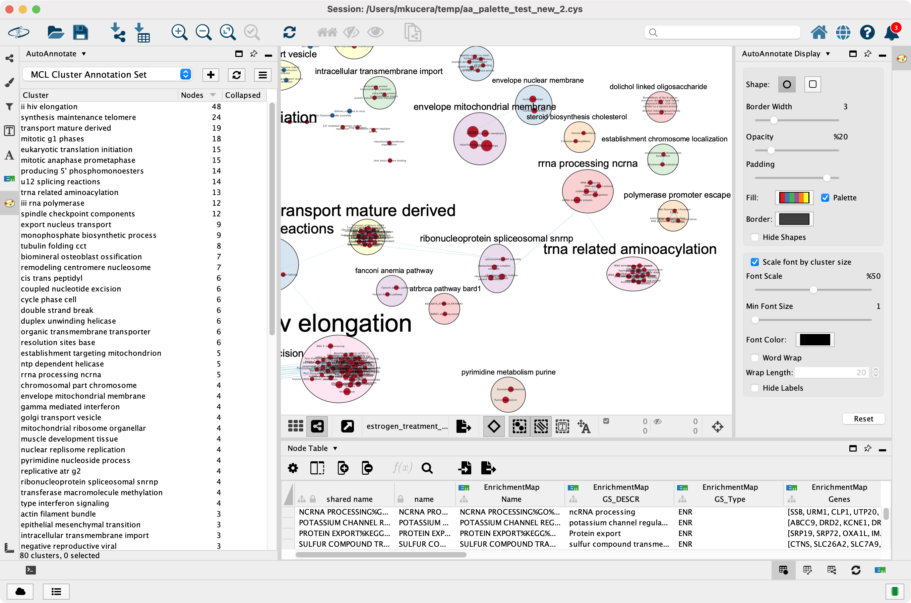

AutoAnnotate Cytoscape App 1.4
==============================

AutoAnnotate is a Cytoscape App that identifies clusters of nodes and automatically draws shape 
and label annotations for each cluster. The generated labels provide a concise semantic summary 
of the data attached to the nodes in each cluster. 

AutoAnnotate maintains a relationship between the annotations and the nodes in a cluster, when the 
layout of the network changes then the annotations are automatically repositioned. 

AutoAnnotate maintains multiple sets of annotations for a single network, which allows you 
to experiment with different clustering algorithms and label generation strategies. Additionally, 
AutoAnnotate allows clusters to be collapsed, which can simplify large networks by reducing 
potentially large sections of the network into single nodes.

.. toctree::
   :maxdepth: 2
   :caption: User Guide

   Installing
   WhatsNew
   CreatingAnAnnotationSet
   External
   WorkingWithAutoAnnotate
   MovingAndResizing
   GroupingAndLayout
   SummaryNetwork
   WordCloud
   Automating
   FilingBugReports
  

.. toctree::
   :maxdepth: 2
   :caption: Links

   Cytoscape.org <http://cytoscape.org>
   Cytoscape App Store <http://apps.cytoscape.org/apps/autoannotate>
   F1000 Article <https://f1000research.com/articles/5-1717>
   Baderlab.org <http://baderlab.org>
   GitHub <https://github.com/BaderLab/AutoAnnotateApp>
