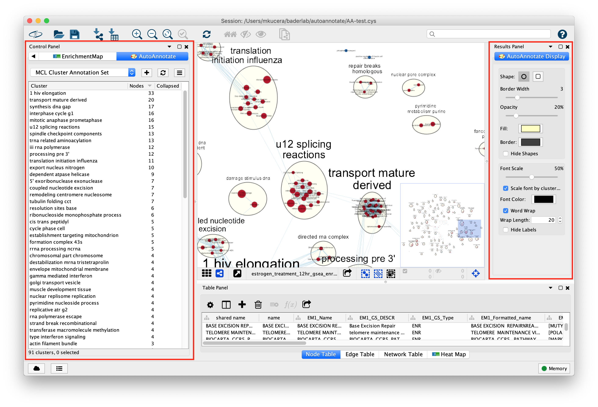

AutoAnnotate Cytoscape App 1.3
==============================

AutoAnnotate is a Cytoscape App that identifies clusters of nodes and automatically draws shape 
and label annotations for each cluster. The generated labels provide a concise semantic summary 
of the data attached to the nodes in each cluster. 

AutoAnnotate maintains a relationship between the annotations and the nodes in a cluster, when the 
layout of the network changes then the annotations are automatically repositioned. 

AutoAnnotate maintains multiple sets of annotations for a single network, which allows you 
to experiment with different clustering algorithms and label generation strategies. Additionally, 
AutoAnnotate allows clusters to be collapsed, which can simplify large networks by reducing 
potentially large sections of the network into single nodes.

New in AutoAnnotate 1.3
-----------------------

* Requires Cytoscape 3.7 
* Drawing annotations is much faster
* Word Wrap feature for cluster labels
* New Feature: copy annotations to another network
* Support for column namespaces
* “annotate” command now returns JSON
* Cleaner layout for “quick start” panel
* Cleaner layout for “display options” panel
* Cleaner menu layouts
* Several bug fixes

.. toctree::
   :maxdepth: 2
   :caption: User Guide

   Installing
   CreatingAnAnnotationSet
   WorkingWithAutoAnnotate
   GroupingAndLayout
   WordCloud
   FilingBugReports
  

.. toctree::
   :maxdepth: 2
   :caption: Links

   Cytoscape.org <http://cytoscape.org>
   Cytoscape App Store <http://apps.cytoscape.org/apps/autoannotate>
   Baderlab.org <http://baderlab.org>
   GitHub <https://github.com/BaderLab/AutoAnnotateApp>
